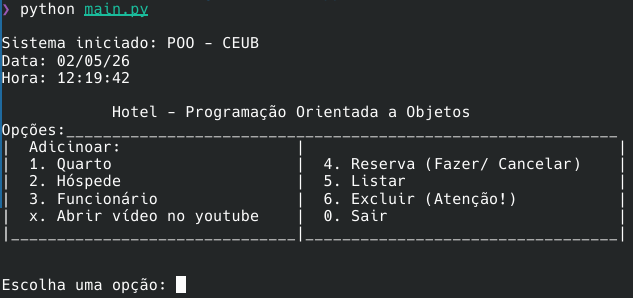

# Sistema de gerenciamento de hotel

<p align="center">
  
  <br>
  <em>Interface inicial do menu de gerenciamento do hotel.</em>
</p>

Projeto desenvolvido para a disciplina de Programação Orientada a Objetos do curso de ADS.

## 🚀 Como executar o projeto
1. Clone o repositório:
git clone https://github.com/Soterop/hotel_python.git
2. **Crie um ambiente virtual (opcional, mas recomendado):**
   ```bash
   python -m venv venv
   source venv/bin/activate  # No Linux (CachyOS/Mint)

3. Execute a aplicação
  'python main.py'

## 🛠 Tecnologias utilizadas
* Linguagem: Python 3.x
* Paradigma: Orientação a Objetos (Classes, Métodos e Gestão de Estado)
* Não persistente

## 📌 Funcionalidades
* Adicionar e excluir quarto, hóspede, funcionário.
* Fazer e excluir reservas.
* Listar quartos, hóspedes, funcionários e reservas.

---
**Desenvolvido por:** Plínio Sotero de Sousa  # hotel_python
